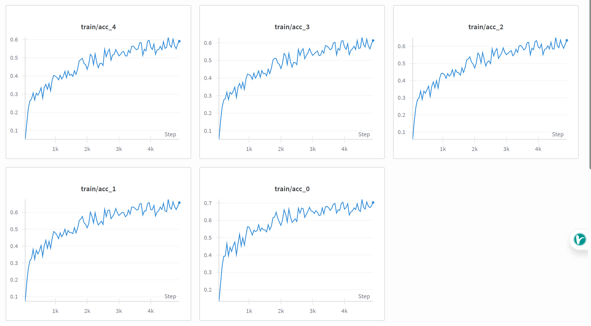

# Speculative decoding

## EAGLE3 Draft Model training

> 4B模型的 EAGLE3 Draft 模型（大约400MB），需要8xH100 数个小时。

```bash
# git clone https://github.com/sgl-project/SpecForge.git
cd SpecForge/
# 不安装依赖，SpecForge 依赖很乱
pip install -v . --no-deps
pip install accelerate
# pip install wandb
# wandb login
# 准备英文数据
python scripts/prepare_data.py --dataset ultrachat
# python scripts/prepare_data.py --dataset sharegpt

#   .filter(lambda example: example['score'] >= 10)\
# 准备中文数据
python -c "import datasets,uuid;\
  ds=datasets.load_dataset('Congliu/Chinese-DeepSeek-R1-Distill-data-110k', split='train')\
  .map(lambda example: {'id': str(uuid.uuid4()), 'conversations': [{'role': 'user', 'content': example['input']}, {'role': 'assistant', 'content': example['content']}]})\
  .select_columns(['id', 'conversations']);\
  ds.to_json('cache/dataset/deepseek-distill-data.jsonl', orient='records', lines=True, force_ascii=False)"

cat cache/dataset/deepseek-distill-data.jsonl cache/dataset/ultrachat_train.jsonl | shuf > cache/dataset/train.jsonl
cat cache/dataset/deepseek-distill-data.jsonl| shuf | head -n 10000 > cache/dataset/deepseek-distill-data-10k.jsonl
cat cache/dataset/ultrachat_train.jsonl | shuf | head -n 10000 > cache/dataset/ultrachat_train-10k.jsonl
cat cache/dataset/deepseek-distill-data-10k.jsonl cache/dataset/ultrachat_train-10k.jsonl | shuf > cache/dataset/train-20k.jsonl

# 可以自己根据母模型的配置文件，修改 draft-model-config，让除了 layers 等参数保持一致 
export NUM_GPUS=1
export TORCHINDUCTOR_CACHE_DIR=cache/compiled_kernels
# export TORCHINDUCTOR_MAX_AUTOTUNE=1 # 规避RTX4090 错误（triton_flex_attention_backward Required: 110080 Hardware limit:101376）
# RTX 4090 做个简单的示例
torchrun \
    --standalone \
    --nproc_per_node $NUM_GPUS \
    scripts/train_eagle3_online.py \
    --target-model-path "../Qwen3-4B-Instruct-2507" \
    --draft-model-config ./configs/qwen3-4b-eagle3.json \
    --train-data-path cache/dataset/train-20k.jsonl \
    --output-dir outputs/Qwen3-4B-Instruct-2507-eagle3 \
    --num-epochs 10 \
    --batch-size 1 \
    --learning-rate 1e-4 \
    --max-length 2048 \
    --chat-template qwen \
    --cache-dir ./cache \
    --embedding-key model.embed_tokens.weight \
    --tp-size $NUM_GPUS \
    --draft-micro-batch-size 1 \
    --draft-global-batch-size 4 \
    --attention-backend sdpa \
    --ttt-length 7

# RTX 4090, --attention-backend sdpa 速度慢，但是显存占用小。
Training Epoch 0:   1%|▏                                     | 126/20000 [11:33<52:37:22,  9.53s/it, loss=8.34, acc=0.02]

# H100 + 20k 测试
torchrun \
    --standalone \
    --nproc_per_node $NUM_GPUS \
    scripts/train_eagle3_online.py \
    --target-model-path "../Qwen3-4B-Instruct-2507" \
    --draft-model-config ./configs/qwen3-4b-eagle3.json \
    --train-data-path cache/dataset/train-20k.jsonl \
    --output-dir outputs/Qwen3-4B-Instruct-2507-eagle3 \
    --num-epochs 6 \
    --batch-size 1 \
    --learning-rate 1e-4 \
    --max-length 2048 \
    --chat-template qwen \
    --cache-dir ./cache \
    --embedding-key model.embed_tokens.weight \
    --tp-size $NUM_GPUS \
    --draft-micro-batch-size 12 \
    --draft-global-batch-size 24 \
    --report-to wandb \
    --log-steps 1 \
    --wandb-project SpecForge-Qwen3-4B-Instruct-2507-eagle3 \
    --wandb-name H100-$(date +%Y%m%d-%H%M) \
    --ttt-length 7

# 20k 条数据 6epoch 时，需要3个多小时。
Training Epoch 0:  27%|▌ | 457/1667 [09:28<21:09,  1.05s/it, loss=1.11, acc=0.34]

训练结果：acc 0.6 左右
Train Epoch [6/6], position 0,  Acc: 0.68
Train Epoch [6/6], position 1,  Acc: 0.63
Train Epoch [6/6], position 2,  Acc: 0.61
Train Epoch [6/6], position 3,  Acc: 0.59
Train Epoch [6/6], position 4,  Acc: 0.57
Train Epoch [6/6], position 5,  Acc: 0.55
Train Epoch [6/6], position 6,  Acc: 0.53
Train Epoch [6/6], position 0, pLoss: 0.49
Train Epoch [6/6], position 1, pLoss: 0.56
Train Epoch [6/6], position 2, pLoss: 0.60
Train Epoch [6/6], position 3, pLoss: 0.63
Train Epoch [6/6], position 4, pLoss: 0.66
Train Epoch [6/6], position 5, pLoss: 0.69
Train Epoch [6/6], position 6, pLoss: 0.72
```



注意：推荐 8xH100 + 246k 数据 + 10 epoch 正式运行，使用大量数据可大幅提升 Acc。

## 推理

vllm: https://docs.vllm.ai/en/stable/features/spec_decode.html?h=speculative+decoding

```bash
vllm serve ../Qwen3-4B-Instruct-2507 --max-model-len 8192 --served-model-name Qwen3-4B-Instruct-2507 --port 30000 \
  --speculative-config '{"model": "outputs/Qwen3-4B-Instruct-2507-eagle3/epoch_5", "draft_tensor_parallel_size": 1, "num_speculative_tokens": 4, "method": "eagle3"}'

curl -X POST http://127.0.0.1:30000/v1/chat/completions \
-H "Content-Type: application/json" \
-d '{
  "model": "Qwen3-4B-Instruct-2507",
  "messages": [
    {"role": "user", "content": "写一篇500字的作文"}
  ], "stream": true
}' 

# 看vllm日志就能看到投机解码的效果
SpecDecoding metrics: Mean acceptance length: 1.28, Accepted throughput: 2.80 tokens/s, Drafted throughput: 39.60 tokens/s, Accepted: 28 tokens, Drafted: 396 tokens, Per-position acceptance rate: 0.263, 0.020, 0.000, 0.000, Avg Draft acceptance rate: 7.1%

# 注：模型仅在20k数据集上训练，效果较差。

```

sglang: https://docs.sglang.ai/advanced_features/speculative_decoding.html

```bash
python3 -m sglang.launch_server \
    --model ../Qwen3-4B-Instruct-2507  \
    --speculative-algorithm EAGLE3 \
    --speculative-draft-model-path outputs/Qwen3-4B-Instruct-2507-eagle3/epoch_5 \
    --speculative-num-steps 3 \
    --speculative-eagle-topk 1 \
    --speculative-num-draft-tokens 4 \
    --context-length 8192 \
    --host 0.0.0.0 \
    --port 30000 \
    --dtype bfloat16
```

## Benchmark

原版：
```bash
python3 -m sglang.launch_server \
    --model ../Qwen3-4B-Instruct-2507  \
    --context-length 8192 \
    --host 0.0.0.0 \
    --port 30000 \
    --dtype bfloat16

evalscope perf \
  --parallel 1 10 20 50 100 \
  --number 10 30 50 100 200 \
  --model Qwen3-4B-Instruct-2507 \
  --url http://127.0.0.1:30000/v1/chat/completions \
  --api openai \
  --dataset random \
  --max-tokens 1024 \
  --min-tokens 1024 \
  --prefix-length 0 \
  --min-prompt-length 1024 \
  --max-prompt-length 1024 \
  --tokenizer-path ../Qwen3-4B-Instruct-2507 \
  --extra-args '{"ignore_eos": true}'
┏━━━━━━┳━━━━━━┳━━━━━━━━━━┳━━━━━━━━━━┳━━━━━━━━━┳━━━━━━━━━━┳━━━━━━━━━┳━━━━━━━━━━┳━━━━━━━━━┳━━━━━━━━━━┓
┃      ┃      ┃      Avg ┃      P99 ┃    Gen. ┃      Avg ┃     P99 ┃      Avg ┃     P99 ┃   Success┃
┃Conc. ┃  RPS ┃  Lat.(s) ┃  Lat.(s) ┃  toks/s ┃  TTFT(s) ┃ TTFT(s) ┃  TPOT(s) ┃ TPOT(s) ┃      Rate┃
┡━━━━━━╇━━━━━━╇━━━━━━━━━━╇━━━━━━━━━━╇━━━━━━━━━╇━━━━━━━━━━╇━━━━━━━━━╇━━━━━━━━━━╇━━━━━━━━━╇━━━━━━━━━━┩
│    1 │ 0.09 │   11.032 │   11.928 │   92.81 │    0.096 │   0.348 │    0.011 │   0.012 │    100.0%│
│   10 │ 0.67 │   14.946 │   15.055 │  685.05 │    0.349 │   0.685 │    0.014 │   0.015 │    100.0%│
│   20 │ 0.97 │   17.598 │   18.273 │  994.93 │    0.600 │   1.190 │    0.017 │   0.018 │    100.0%│
│   50 │ 1.45 │   28.611 │   37.472 │ 1487.68 │    2.319 │  19.100 │    0.026 │   0.034 │    100.0%│
│  100 │ 1.51 │   53.109 │   94.607 │ 1544.44 │   23.665 │  55.678 │    0.029 │   0.062 │    100.0%│
└──────┴──────┴──────────┴──────────┴─────────┴──────────┴─────────┴──────────┴─────────┴──────────┘

python benchmarks/run_humaneval.py --parallel 1 --num-questions 10
Latency: 47.133 s
Output throughput: 93.183 token/s
Accept length: 1.000

python benchmarks/run_mtbench.py --parallel 1 --num-questions 10
Number of questions: 10
Output throughput: 90.176 token/s
Accept length: 1.000
```

sglang 单线程的输出速度在 90 Tokens/s，和 vLLM 差不多。

With Speculative Decoding：

```bash
python3 -m sglang.launch_server \
    --model ../Qwen3-4B-Instruct-2507  \
    --speculative-algorithm EAGLE3 \
    --speculative-draft-model-path outputs/Qwen3-4B-Instruct-2507-eagle3/epoch_5 \
    --speculative-num-steps 3 \
    --speculative-eagle-topk 1 \
    --speculative-num-draft-tokens 4 \
    --context-length 8192 \
    --host 0.0.0.0 \
    --port 30000 \
    --dtype bfloat16

python benchmarks/run_humaneval.py --parallel 1 --num-questions 10
Latency: 46.727 s
Output throughput: 123.612 token/s
Accept length: 1.719

python benchmarks/run_mtbench.py --parallel 1 --num-questions 10
Number of questions: 10
Output throughput: 113.581 token/s
Accept length: 1.574
```

可以看到，使用 Speculative Decoding 后， 单用户的输出吞吐量有所提升（但是没有到论文中那么大，这是因为我们训练的 EAGLE3 模型数据量太小导致 Acc 不高），提升幅度：(120-90)/90 = 33.3%

## 思考

投机解码的 EAGLE3 模型是在数据集上训练出来的，所以会和数据集的分布有关，应尽量选择和下游任务相关的数据集进行训练。
